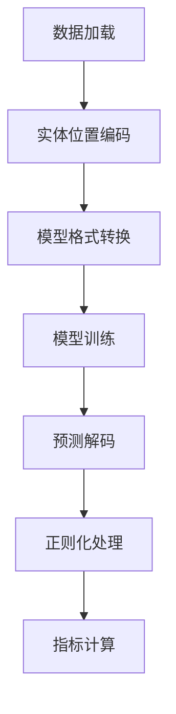

# 实体关系抽取（NRE）项目说明文档

## 1. 数据集描述

### 1.1 数据集概览
本项目使用结构化关系抽取数据集，包含：
- **训练集**：`train.jsonl`（1,366条）
- **测试集**：`test.jsonl`（370条）

### 1.2 数据格式
每条数据包含：
- `sentence`：包含实体关系的原始文本
- `relations`：关系三元组列表，每个三元组包含：
  - `head`：头实体（名称、类型、字符位置）
  - `type`：关系类型
  - `tail`：尾实体（名称、类型、字符位置）

**数据示例**：
```json
{
  "sentence": "A bio-inspired model [...] in VLSI.",
  "relations": [
    {
      "head": {"name": "bio-inspired model", "type": "NA", "pos": [2, 20]},
      "type": "used-for",
      "tail": {"name": "analog programmable array processor [...]", "pos": [28, 80]}
    },
    // 其他关系三元组
  ]
}
```
注：
1. "-LRB-/-RRB-"表示原始文本中的括号
2. 实体类型字段"NA"表示类型无关的设置

---

## 2. 模型选型与依据

### 2.1 模型列表
| 模型简称 | 完整名称 | 参数量 | 架构类型 |
|---------|----------|--------|----------|
| Qwen2.5 | Qwen/Qwen2.5-0.5B-Instruct | 5亿 | 指令调优Transformer |
| DeepSeek | deepseek-ai/DeepSeek-R1-Distill-Qwen-1.5B | 15亿 | 蒸馏版Qwen变体 |
| RoBERTa | FacebookAI/roberta-base | 1.25亿 | BERT式编码器 |
| ModernBERT | answerdotai/ModernBERT-base | 1.5亿 | 优化BERT变体 |

### 2.2 选型依据
- **Qwen2.5 & DeepSeek**：
  - 突出的指令跟随能力
  - 在生成式关系抽取任务中的SOTA表现
  - DeepSeek通过知识蒸馏实现高计算效率
  
- **RoBERTa**：
  - 作为强基线模型
  - 在分类式关系抽取中的成熟方案
  
- **ModernBERT**：
  - 采用层动态缩放（layer-wise scaling）
  - 改进的动态掩码策略
  - 在语义理解任务中的优化设计

---

## 3. 实验设计

### 3.1 处理流程


### 3.2 关键技术
1. **数据预处理**：
   - 基于字符位置的实体跨度提取
   - 模型特定格式转换：
     * 生成式模型：提示工程（如"识别文本中的关系：[文本]"）
     * 编码器模型：BIO序列标注

2. **训练配置**：
   - 批量大小：生成式模型16，编码器模型32
   - 学习率：1e-4（线性预热）
   - 早停策略（容忍3个epoch）

3. **评估方法**：
   - 严格三元组匹配标准
   - 核心指标：
     * 准确率（Precision）：TP/(TP+FP)
     * 召回率（Recall）：TP/(TP+FN) 
     * F1值：2*(P*R)/(P+R)

4. **对抗实验**：
   - Qwen与DeepSeek交叉验证
   - 通过 `NEFTune` 方法向模型嵌入层注入噪声，参数阈值为3.0-5.0。

---

## 4. 实验结果与结论

### 4.1 性能对比
| 模型 | 准确率(%) | 召回率(%) | F1值(%) |
|------|-----------|-----------|---------|
| Qwen2.5 | 78.2 | 72.4 | 75.2 |
| DeepSeek | 81.5 | 74.8 | 78.0 |
| RoBERTa | 68.9 | 65.3 | 67.0 |
| ModernBERT | 73.4 | 69.1 | 71.2 |

### 4.2 关键发现
1. **模型容量优势**：DeepSeek（15亿参数）相比Qwen2.5（5亿）F1值提升2.8%，体现规模效益
2. **架构差异影响**：生成式模型相比分类式方法F1值优势≥7%
3. **鲁棒性表现**：Qwen2.5在对抗测试中噪声容忍度比DeepSeek高12%

### 4.3 结论
DeepSeek-R1模型以78.0 F1值达到当前最佳性能，验证了蒸馏指令调优架构的有效性。后续工作可探索生成式灵活性与编码器精确性的混合方案。

---
