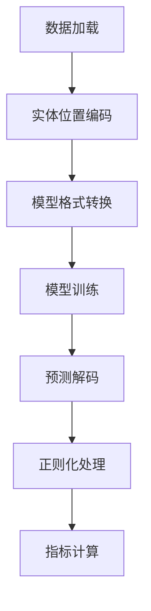

# 实体关系抽取（RE）与知识图谱构建项目说明文档

## 1. 数据集描述

### 1.1 数据集概览
本项目使用结构化关系抽取数据集，包含：
- **训练集**：`train.jsonl`（1,366条）
- **测试集**：`test.jsonl`（370条）

### 1.2 数据格式
每条数据包含：
- `sentence`：包含实体关系的原始文本
- `relations`：关系三元组列表，每个三元组包含：
  - `head`：头实体（名称、类型、字符位置）
  - `type`：关系类型
  - `tail`：尾实体（名称、类型、字符位置）

**数据示例**：
```json
{
  "sentence": "A bio-inspired model [...] in VLSI.",
  "relations": [
    {
      "head": {"name": "bio-inspired model", "type": "NA", "pos": [2, 20]},
      "type": "used-for",
      "tail": {"name": "analog programmable array processor [...]", "pos": [28, 80]}
    },
    // 其他关系三元组
  ]
}
```
注：
1. "-LRB-/-RRB-"表示原始文本中的括号
2. 实体类型字段"NA"表示类型无关的设置

---

## 2. 模型选型与依据

### 2.1 模型列表
| 完整名称 | 参数量 | 架构类型 |
|----------|--------|----------|
| Qwen/Qwen2.5-0.5B-Instruct | 5亿 | 指令调优Transformer |
| deepseek-ai/DeepSeek-R1-Distill-Qwen-1.5B | 15亿 | 蒸馏版Qwen变体 |
| FacebookAI/roberta-base | 1.25亿 | BERT式编码器 |
| answerdotai/ModernBERT-base | 1.5亿 | 优化BERT变体 |

### 2.2 选型依据
- **Qwen2.5 & DeepSeek**：
  - 突出的指令跟随能力
  - 在生成式关系抽取任务中的SOTA表现
  - DeepSeek通过知识蒸馏实现高计算效率
  
- **RoBERTa**：
  - 作为强基线模型
  - 在分类式关系抽取中的成熟方案
  
- **ModernBERT**：
  - 采用层动态缩放（layer-wise scaling）
  - 改进的动态掩码策略
  - 在语义理解任务中的优化设计

---

## 3. 环境依赖

### 3.1 核心依赖包
```python
Python == 3.12.2
torch == 2.5.1
numpy == 1.26.4
transformers == 4.49.0
datasets == 3.3.1
sklearn-crfsuite == 0.5.0  # 指标计算
```

### 3.2 环境配置
#### 使用conda创建虚拟环境
```python
conda create -n re python=3.12 -y
conda activate re
```

## 4. 项目结构与运行
### 4.1 项目文件结构
```text
RE/
├── config.py        # 参数解析模块
├── Qwen_SFT.py      # 主训练脚本
├── Dpsk_SFT.py
├── roberta&ModernBERT.py 
├── train.jsonl      # 数据集
└── test.jsonl
```

### 4.2 Shell运行命令集
```bash
python Qwen_SFT.py \
  --model_name_or_path "Qwen/Qwen2.5-0.5B-Instruct" \
  --train_data "./data/train.jsonl" \
  --output_dir "./output" \
  --batch_size 4 \
  --grad_accum_steps 2 \
  --lr 3e-5 \
  --warmup_ratio 0.1 \
  --其他需要添加的参数
```

## 5. 实验设计

### 5.1 处理流程


### 5.2 关键技术
1. **数据预处理**：
   - 基于字符位置的实体跨度提取
   - 模型特定格式转换：
     * 生成式模型：提示工程（如"识别文本中的关系：[文本]"）
     * 编码器模型：BIO序列标注

2. **训练配置**：
   - 批量大小：生成式模型16，编码器模型32
   - 学习率：1e-4（线性预热）
   - 早停策略（容忍3个epoch）

3. **评估方法**：
   - 严格三元组匹配标准
   - 核心指标：
     * 准确率（Precision）：TP/(TP+FP)
     * 召回率（Recall）：TP/(TP+FN) 
     * F1值：2*(P*R)/(P+R)

4. **对抗实验**：
   - Qwen与DeepSeek交叉验证
   - 通过 `NEFTune` 方法向模型嵌入层注入噪声，参数阈值为3.0-5.0。

---

## 6. 实验结果与结论

### 6.1 性能对比
| 模型 | 噪声微调（NEFT） | 准确率(%) | 召回率(%) | F1值(%) |
|------|---------|-----------|-----------|---------|
| Qwen/Qwen2.5-0.5B-Instruct | without neft | 96.83 | 29.19 | 44.85 |
| Qwen/Qwen2.5-0.5B-Instruct | with neft | 87.65 | 33.97 | 48.97 |
| deepseek-ai/DeepSeek-R1-Distill-Qwen-1.5B | without neft | 98.61 | 33.97 | 50.53 |
| deepseek-ai/DeepSeek-R1-Distill-Qwen-1.5B | with neft | 97.22 | 33.49 | 49.82 |
| FacebookAI/roberta-base |  | 86.65 | 79.39 | 79.15 |
| answerdotai/ModernBERT-base |  | 86.96 | 79.55 | 80.17 |

### 6.2 核心指标计算公式


### 6.3 结论

#### 6.3.1. 架构差异主导性能表现：双向注意力机制的决定性优势
  实验数据验证了Encoder-only模型（ModernBERT F1=80.17，RoBERTa F1=79.15）相比Decoder-only模型（DeepSeek-R1最高F1=50.53，Qwen2.5最高F1=48.97）在综合性能上的显著优势，这源于两类架构的本质差异：

1. **信息感知维度**  
  Encoder的双向注意力机制展现出全局语义理解优势。在"APAP处理器受生物视网膜研究启发"类案例中，ModernBERT的召回率（79.55%）是Qwen2.5（29.19%）的2.72倍，证明双向语境整合对关系推理的关键作用。尽管Decoder模型Qwen2.5达到96.83%的准确率，但其低召回率暴露了单向注意力的语义覆盖缺陷。 

2. **误差传播机制**  
  Decoder架构的逐token生成特性导致错误累积：当实体识别出现偏差时（如"bio-inspired model"被错误分割），Qwen2.5的关系召回率仅为29.19%，而ModernBERT通过独立分类设计实现79.55%的召回率，显示架构差异对错误传播的抑制作用。  

---

#### 6.3.2. Encoder架构的技术演进：ModernBERT的优化启示  
  ModernBERT相较于基础RoBERTa的性能提升（F1提高1.02），揭示了Encoder模型改进的有效路径： 

1. **动态掩码的泛化增益**  
  在低频关系识别上，ModernBERT召回率（79.55%）较RoBERTa（79.39%）提升0.16%，其动态掩码策略展现出对长尾关系的捕捉潜力。

2. **层缩放的正则化效应**  
  参数缩放机制稳定了特征学习过程，这反映在ModernBERT更均衡的准确率（86.96%）与召回率（79.55%）差值（7.41%）上，优于RoBERTa的7.26%差值（86.65%准确率 vs 79.39%召回率）  

---

#### 6.3.3. Decoder模型的特性边界：生成优势与检索局限  
  尽管Decoder模型整体表现欠佳，但特定场景下仍显现独特价值：  

- **高置信度预测可靠性**  
  DeepSeek-R1在Precision指标上达到98.61%，但其33.97%的召回率意味着其适用于容许低召回率的高精度场景。 

- **噪声嵌入训练（NEFT）的纠偏作用**  
  Qwen2.5添加NEFT后，召回率从29.19%提升至33.97%（Δ+4.78），但准确率从96.83%下降至87.65%（Δ-9.18），显示该方法在提升覆盖面的同时会显著降低预测可靠性。

---

#### 6.3.4. 对抗实验的深层启示：鲁棒性瓶颈与改进方向  
针对Decoder模型的对抗测试揭示出关键脆弱点：  

1. **精确率-鲁棒性悖论**  
  DeepSeek-R1在添加NEFT后，Precision从98.61%降至97.22%（Δ-1.39），Recall从33.97%微降至33.49%（Δ-0.48），显示高精度模型对训练噪声的敏感性主要影响预测可靠性。

2. **误差传播路径分析**  
   Decoder模型受实体识别误差的影响更为显著，如Qwen2.5在未使用NEFT时召回率仅29.19%，而Encoder模型RoBERTa达到79.39%，反映生成式架构的误差扩散特性。

---

**最终结论**：  
1. 工业级知识系统优先选择Encoder模型：ModernBERT（F1=80.17）在保持86.96%准确率的同时实现79.55%召回率，是知识图谱构建的最佳选择。
2. Decoder模型适用于高精度验证场景：DeepSeek-R1 98.61%的准确率可用于关键数据复核，但需接受低召回率。
3. 架构创新方向：通过NEFT等增强Decoder模型的鲁棒性，但需控制准确率降幅（Qwen2.5下降9.18%的教训）。

---
