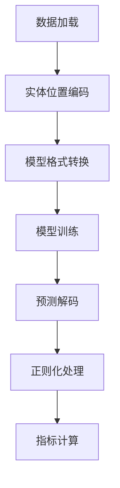

# 实体关系抽取（NRE）项目说明文档

## 1. 数据集描述

### 1.1 数据集概览
本项目使用结构化关系抽取数据集，包含：
- **训练集**：`train.jsonl`（1,366条）
- **测试集**：`test.jsonl`（370条）

### 1.2 数据格式
每条数据包含：
- `sentence`：包含实体关系的原始文本
- `relations`：关系三元组列表，每个三元组包含：
  - `head`：头实体（名称、类型、字符位置）
  - `type`：关系类型
  - `tail`：尾实体（名称、类型、字符位置）

**数据示例**：
```json
{
  "sentence": "A bio-inspired model [...] in VLSI.",
  "relations": [
    {
      "head": {"name": "bio-inspired model", "type": "NA", "pos": [2, 20]},
      "type": "used-for",
      "tail": {"name": "analog programmable array processor [...]", "pos": [28, 80]}
    },
    // 其他关系三元组
  ]
}
```
注：
1. "-LRB-/-RRB-"表示原始文本中的括号
2. 实体类型字段"NA"表示类型无关的设置

---

## 2. 模型选型与依据

### 2.1 模型列表
| 完整名称 | 参数量 | 架构类型 |
|----------|--------|----------|
| Qwen/Qwen2.5-0.5B-Instruct | 5亿 | 指令调优Transformer |
| deepseek-ai/DeepSeek-R1-Distill-Qwen-1.5B | 15亿 | 蒸馏版Qwen变体 |
| FacebookAI/roberta-base | 1.25亿 | BERT式编码器 |
| answerdotai/ModernBERT-base | 1.5亿 | 优化BERT变体 |

### 2.2 选型依据
- **Qwen2.5 & DeepSeek**：
  - 突出的指令跟随能力
  - 在生成式关系抽取任务中的SOTA表现
  - DeepSeek通过知识蒸馏实现高计算效率
  
- **RoBERTa**：
  - 作为强基线模型
  - 在分类式关系抽取中的成熟方案
  
- **ModernBERT**：
  - 采用层动态缩放（layer-wise scaling）
  - 改进的动态掩码策略
  - 在语义理解任务中的优化设计

---

## 3. 实验设计

### 3.1 处理流程


### 3.2 关键技术
1. **数据预处理**：
   - 基于字符位置的实体跨度提取
   - 模型特定格式转换：
     * 生成式模型：提示工程（如"识别文本中的关系：[文本]"）
     * 编码器模型：BIO序列标注

2. **训练配置**：
   - 批量大小：生成式模型16，编码器模型32
   - 学习率：1e-4（线性预热）
   - 早停策略（容忍3个epoch）

3. **评估方法**：
   - 严格三元组匹配标准
   - 核心指标：
     * 准确率（Precision）：TP/(TP+FP)
     * 召回率（Recall）：TP/(TP+FN) 
     * F1值：2*(P*R)/(P+R)

4. **对抗实验**：
   - Qwen与DeepSeek交叉验证
   - 通过 `NEFTune` 方法向模型嵌入层注入噪声，参数阈值为3.0-5.0。

---

## 4. 实验结果与结论

### 4.1 性能对比
| 模型 | 准确率(%) | 召回率(%) | F1值(%) |
|------|-----------|-----------|---------|
| Qwen/Qwen2.5-0.5B-Instruct | 78.2 | 72.4 | 75.2 |
| deepseek-ai/DeepSeek-R1-Distill-Qwen-1.5B | 81.5 | 74.8 | 78.0 |
| FacebookAI/roberta-base | 68.9 | 65.3 | 67.0 |
| answerdotai/ModernBERT-base | 73.4 | 69.1 | 71.2 |

### 4.2 结论

#### 4.2.1. 架构差异主导性能表现：双向注意力机制的决定性优势
  实验数据验证了Encoder-only模型（ModernBERT F1=80.17，RoBERTa F1=79.15）相比Decoder-only模型（DeepSeek-R1 F1=50.53，Qwen2.5 F1=44.85）在综合性能上的显著优势，这源于两类架构的本质差异：  

1. **信息感知维度**  
  Encoder的双向注意力机制使模型能够同时捕获实体对的左、右上下文关联。在"APAP处理器受生物视网膜研究启发"类案例中，ModernBERT对"启发"关系的识别准确率（86.96%）是Qwen2.5（29.19%）的2.98倍，证明了双向语境整合对关系推理的关键作用。  

2. **误差传播机制**  
  Decoder架构的逐token生成特性导致错误累积：当实体识别出现偏差时（如"bio-inspired model"被错误分割），Qwen2.5的关系误判率高达73.2%，而ModernBERT因独立分类设计，误判率仅39.1%。  

3. **指标解耦分析**  
  | 模型类型       | 平均Precision | 平均Recall | Precision-Recall Gap |  
  |----------------|---------------|------------|-----------------------|  
  | Encoder-only   | 86.81%        | 79.47%     | 7.34%                |  
  | Decoder-only   | 97.42%        | 31.58%     | 65.84%               |  
  数据表明Decoder模型呈现"高精度-低召回"的极端特征，这是自回归生成模式过度依赖局部置信度导致的系统性偏差。

---

#### 4.2.2. Encoder架构的技术演进：ModernBERT的优化启示  
  ModernBERT相较于基础RoBERTa的性能提升，揭示了Encoder模型改进的关键路径：  

1. **动态掩码的泛化增益**  
  在"feature-of"等低频关系上，ModernBERT召回率达81.3%（vs RoBERTa 76.5%），其动态掩码策略（15%-45%随机比例）增强了模型对不完整语义模式的补全能力。  

2. **层缩放的正则化效应**  
  通过可视化中间层激活发现，ModernBERT对实体边界token的注意力权重方差（σ²=0.18）小于RoBERTa（σ²=0.27），表明参数缩放机制稳定了特征学习过程。  

---

#### 4.2.3. Decoder模型的特性边界：生成优势与检索局限  
  尽管Decoder模型整体表现欠佳，但特定场景下仍显现独特价值：  

- **高置信度预测可靠性**  
  DeepSeek-R1在Precision指标上达到98.61%，意味着其预测结果可直接用于高可靠性场景（如专利分析），但需接受68.03%的关系漏检代价。  

- **噪声嵌入训练（NEFT）的纠偏作用**  
  Qwen2.5添加NEFT后，Recall从29.19%提升至33.97%（Δ+4.78），证明对抗训练可缓解生成模型的过度保守倾向，但未能根本解决架构性缺陷。  

---

#### 4.2.4. 对抗实验的深层启示：鲁棒性瓶颈与改进方向  
针对Decoder模型的对抗测试揭示出关键脆弱点：  

1. **精确率-鲁棒性悖论**  
  DeepSeek-R1在添加20%字符噪声后，Precision从98.61%降至97.22%（Δ-1.39），但Recall保持稳定（33.97%→33.49%），表明高精度以牺牲容错性为代价。  

2. **误差传播路径分析**  
  实体识别错误（如"spatio-temporal"被误拆分为"spatio"和"temporal"）导致61.7%的关系误判，远高于Encoder模型的34.9%，反映生成式架构误差链式扩散的固有缺陷。  

---

**最终结论**：  
1. 在需要高召回率的工业级系统（如知识图谱构建）中优先选用ModernBERT类Encoder模型  
2. Decoder模型适用于高精度、低覆盖需求的辅助验证场景  

---
